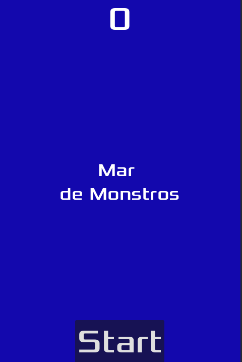
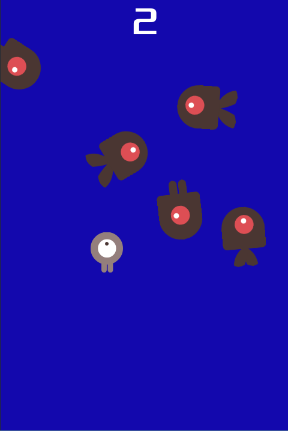

# 🌊 Mar de Monstros

**Mar de Monstros** é um jogo arcade simples feito na Godot Engine. O jogador controla um personagem que precisa sobreviver o maior tempo possível, desviando de monstros que surgem aleatoriamente na tela.

## 📸 Capturas de Tela

  
  

## 🎮 Como Jogar

- Use as **setas do teclado** para mover o personagem.
- Desvie dos monstros que aparecem aleatoriamente na tela.
- A cada segundo que você sobrevive, sua **pontuação aumenta**.
- Se você for atingido por um monstro, o jogo acaba.

## 🧠 Mecânicas

- Os monstros são instanciados em posições aleatórias ao longo de um caminho (`MobPath`) e seguem direções levemente aleatórias.
- O jogador pode se mover livremente, mas é limitado pelas bordas da tela.
- O jogo começa ao clicar no botão "Start".
- Ao colidir com um monstro, o jogador morre e a mensagem "Game Over" é exibida.

## 🧱 Estrutura do Projeto

- `Main`: Nó principal do jogo, gerencia timers, instância de mobs e controle do fluxo do jogo.
- `Player (Area2D)`: Controlado pelo jogador. Pode se mover e detectar colisões com mobs.
- `Mob (RigidBody2D)`: Inimigos que se movem em linha reta a partir de um ponto aleatório.
- `HUD (CanvasLayer)`: Exibe pontuação, mensagens e botão de início.
- `StartButton`: Botão que inicia o jogo.
- `MessageTimer`, `ScoreTimer`, `StartTimer`, `MobTimer`: Timers que controlam a exibição de mensagens, pontuação e criação de monstros.

## 📦 Recursos Exportáveis

O código utiliza variáveis `@export` para permitir ajustes diretos pelo editor:

- `Mob`: Cena de monstro instanciada durante o jogo.
- `min_speed`, `max_speed`: Controle da velocidade mínima e máxima dos monstros.
- `speed`: Velocidade de movimento do jogador.

## 🔊 Áudio

- `Music`: Música de fundo durante o jogo.
- `DeathSound`: Som reproduzido ao colidir com um monstro.

## 🛠️ Requisitos

- [Godot Engine 4.x](https://godotengine.org/download)

## ▶️ Executar

1. Clone ou baixe este repositório.
2. Abra a pasta no Godot.
3. Execute a cena principal (`Main.tscn`).
4. Clique em "Start" para iniciar o jogo!
